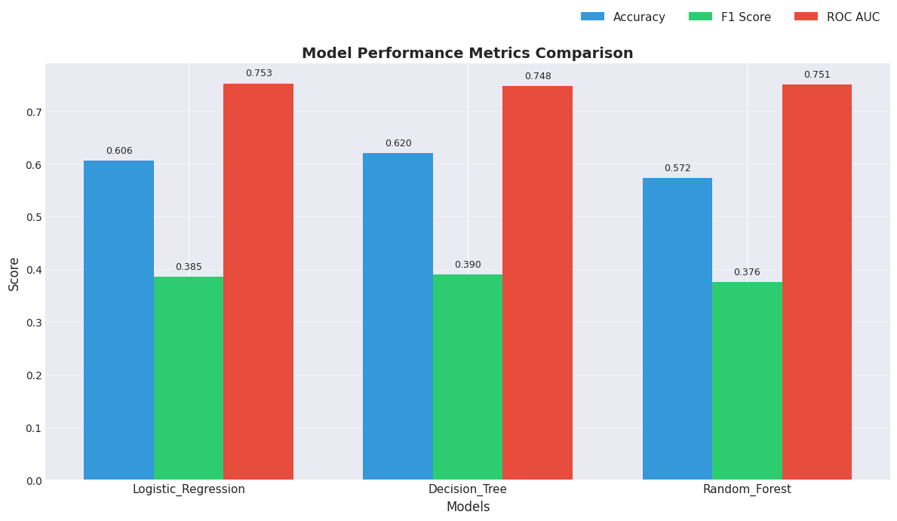
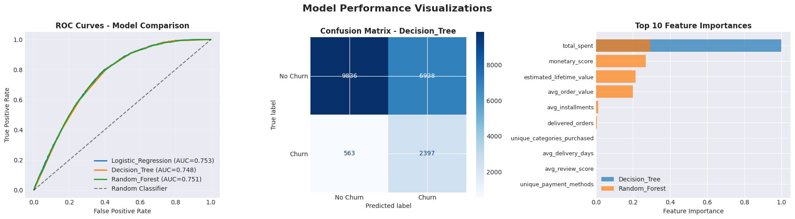

# 🇧🇷 Brazilian E-Commerce Customer Churn Prediction

An end-to-end machine learning pipeline that predicts which customers are likely to churn and translates those predictions into actionable business decisions.

This project builds a complete data and AI workflow on the Brazilian e-commerce dataset, starting from raw transactional tables and ending with churn risk dashboards and ROI analysis for retention campaigns.

## 🎯 Problem Definition

Customer churn is one of the most critical problems in e-commerce.
Instead of reacting after customers leave, the goal is to predict churn in advance so that the business can intervene early.

This project frames churn prediction as a supervised binary classification task:

Input: historical customer behaviour, spending, reviews, delivery experience, and engagement signals
Output: probability that a customer will churn
Success criteria: accurately identify high-risk customers and convert predictions into profitable retention actions

Rule-based systems cannot capture complex behaviour patterns across thousands of customers.
Machine learning is used to discover hidden risk signals from rich behavioural data.

## 📦 Dataset

This project uses the Brazilian E-Commerce Public Dataset from Kaggle:

🔗 https://www.kaggle.com/datasets/olistbr/brazilian-ecommerce

The dataset contains real-world transactional data including customers, orders, products, payments, reviews, and geolocation information, enabling rich behavioural and lifecycle feature creation for churn prediction.

## 🏗️ End-to-End Data & AI Pipeline

A layered lakehouse architecture is implemented:

- Bronze Layer – raw ingested tables (orders, customers, products, payments, reviews, etc.)
- Silver Layer – cleaned and joined data with a customer 360° view
- Gold Layer – advanced feature engineering for analytics and ML
- ML Layer – churn model training and prediction storage
- Analytics Layer – SQL dashboards and business insights

This design guarantees:

- reproducibility
- clear separation of concerns
- fast, repeatable model experimentation

## 🧠 Feature Engineering

More than 25 ML-ready features are created per customer, including:

- purchase behaviour (orders, total spend, average order value)
- product diversity and category coverage
- payment and installment behaviour
- review patterns and customer satisfaction
- delivery time experience
- counts of delivered, cancelled, and unavailable orders
- geographic context (local average spending)
- lifecycle and value segments for business targeting

These features capture not only how much customers buy, but how they experience the service.

## 🔖 Churn Label Design

A realistic and imbalanced churn label (~15% churners) is generated independently from the prediction features to avoid data leakage.

The task becomes:

“Which customers are most likely to churn soon?”

This enables proactive retention instead of reactive reporting.

## 🤖 Model Selection & Training

Three well-regularised baseline models are trained and compared:

- Logistic Regression
- Decision Tree
- Random Forest

Key design choices:

- stratified train/test split
- class balancing for imbalanced churn data
- strong regularisation and shallow trees to prevent overfitting
- focus on ROC-AUC and F1 rather than accuracy

## 📈 Model Performance Comparison

All models achieve around ROC-AUC ≈ 0.75, showing good separation between risky and safe customers.

The Decision Tree achieves the best F1 score and is selected as the final model for deployment.

Visual Evaluation (ROC & Confusion Matrix)

- ROC curves confirm strong ranking ability well above random guessing.
- A tuned lower decision threshold increases recall for churners.

The confusion matrix shows the model intentionally prioritises catching churners, which is more valuable for retention campaigns than maximising overall accuracy.

## ⚠️ Churn Risk Segmentation

Predicted probabilities are converted into clear business risk levels:

- Low
- Medium
- High

Approximately 47,000 customers fall into the High-risk bucket.

This makes the output directly usable by marketing and CRM teams.

Risk Analysis by Customer Segment

Key insights from segment analysis:

- very new, very low-value customers form the largest and riskiest group
- high-value customers show very low churn risk
- enables targeted, segment-specific retention strategies instead of one-size-fits-all campaigns

## 📊 Churn Dashboard & Geographic Insights

SQL dashboards provide:

- risk distribution across the full customer base
- top Brazilian states with the highest concentration of high-risk users
- churn patterns by lifecycle and value segment

This supports targeted and region-aware marketing actions.

## 💰 Business Impact & ROI

A simulated retention campaign on high-risk customers shows clear financial value:

- high-risk customers identified: ~47k
- revenue currently at risk: > R$2M
- campaign cost (R$10 incentive each): ~R$469k
- even with only 25% success, retained value exceeds campaign cost

ROI ≈ 1.11×
For every R$1 spent, the business gets about R$1.11 back.

This proves the model is economically beneficial, not just technically accurate.

## 🔁 Database ↔ AI Closed Loop

The pipeline demonstrates a full production-style loop:

1.Load raw data from database tables
2.Engineer ML features inside the data platform
3.Train models and generate churn probabilities
4.Save predictions back to database tables
5.Query predictions via SQL for dashboards and decisions

This makes the solution repeatable, auditable, and deployment-ready.

## 📖 Reproducibility & Project Structure

The workflow is organised as sequential notebooks:

1.Raw data ingestion (Bronze)
2.Cleaning and customer 360 (Silver)
3.Feature engineering (Gold)
4.Model training and churn scoring
5.Business dashboards and ROI analysis

Running the pipeline end-to-end rebuilds everything from raw data to final churn insights.

## 🚀 Key Outcomes

- Robust churn prediction on ~98k customers
- Interpretable risk segments enabling targeted retention
- SQL dashboards for non-technical stakeholders
- Quantified financial ROI for retention campaigns
- Fully reproducible, layered lakehouse data-to-AI pipeline

## 👨‍💻 Author

Yoseph Negash
📧 yosephn22@gmail.com
📅 2026
